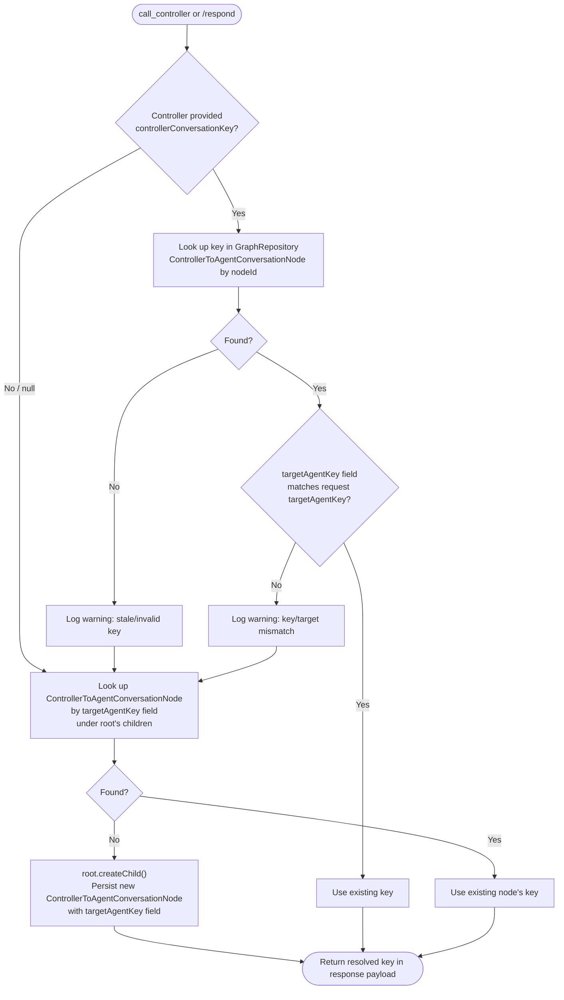
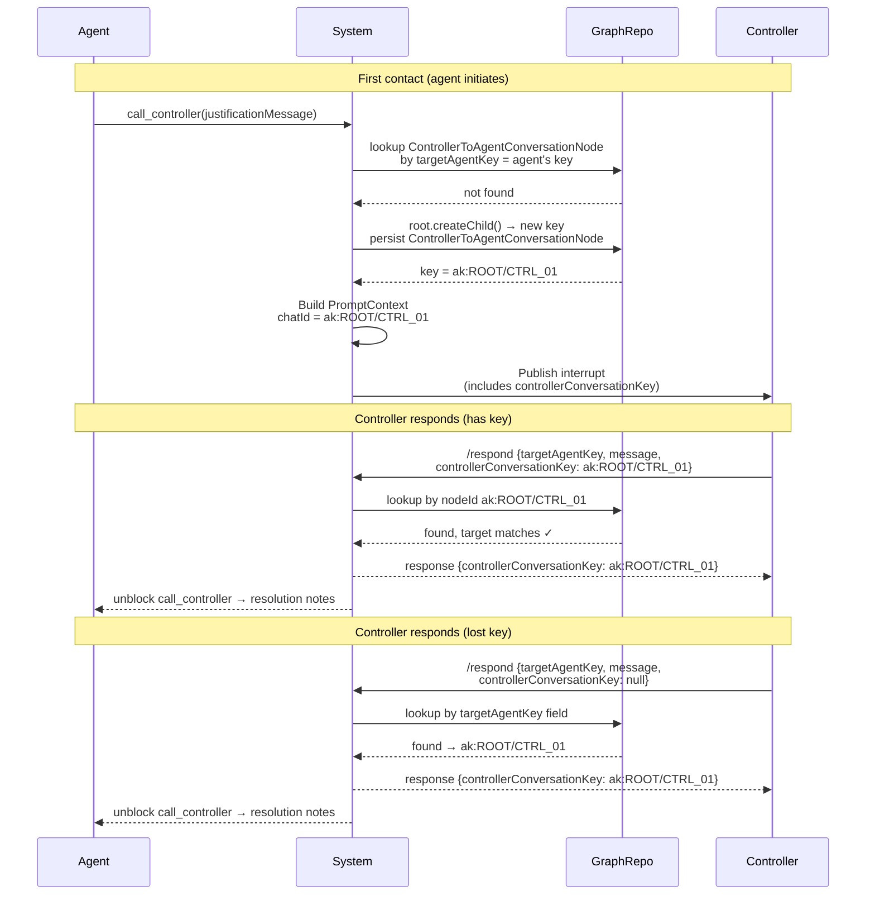

# Controller Conversation Key Lifecycle

## Resolution Algorithm (every call)

```mermaid
flowchart TD
    START([call_controller or /respond]) --> CHECK{Controller provided<br/>controllerConversationKey?}

    CHECK -->|Yes| LOOKUP_KEY[Look up key in GraphRepository<br/>ControllerToAgentConversationNode by nodeId]
    CHECK -->|No / null| LOOKUP_TARGET

    LOOKUP_KEY --> FOUND_KEY{Found?}
    FOUND_KEY -->|No| WARN1[Log warning: stale/invalid key] --> LOOKUP_TARGET
    FOUND_KEY -->|Yes| VALIDATE{targetAgentKey field<br/>matches request targetAgentKey?}

    VALIDATE -->|No| WARN2[Log warning: key/target mismatch] --> LOOKUP_TARGET
    VALIDATE -->|Yes| USE_KEY[Use existing key]

    LOOKUP_TARGET[Look up ControllerToAgentConversationNode<br/>by targetAgentKey field<br/>under root's children] --> FOUND_TARGET{Found?}

    FOUND_TARGET -->|Yes| USE_EXISTING[Use existing node's key]
    FOUND_TARGET -->|No| CREATE[root.createChild&lpar;&rpar;<br/>Persist new ControllerToAgentConversationNode<br/>with targetAgentKey field]

    CREATE --> RETURN
    USE_KEY --> RETURN
    USE_EXISTING --> RETURN
    RETURN([Return resolved key in response payload])
```

## Key Creation Timing

```mermaid
sequenceDiagram
    participant Agent
    participant System
    participant GraphRepo
    participant Controller

    Note over Agent,Controller: First contact (agent initiates)
    Agent->>System: call_controller(justificationMessage)
    System->>GraphRepo: lookup ControllerToAgentConversationNode<br/>by targetAgentKey = agent's key
    GraphRepo-->>System: not found
    System->>GraphRepo: root.createChild() → new key<br/>persist ControllerToAgentConversationNode
    GraphRepo-->>System: key = ak:ROOT/CTRL_01
    System->>System: Build PromptContext<br/>chatId = ak:ROOT/CTRL_01
    System->>Controller: Publish interrupt<br/>(includes controllerConversationKey)

    Note over Agent,Controller: Controller responds (has key)
    Controller->>System: /respond {targetAgentKey, message,<br/>controllerConversationKey: ak:ROOT/CTRL_01}
    System->>GraphRepo: lookup by nodeId ak:ROOT/CTRL_01
    GraphRepo-->>System: found, target matches ✓
    System-->>Controller: response {controllerConversationKey: ak:ROOT/CTRL_01}
    System-->>Agent: unblock call_controller → resolution notes

    Note over Agent,Controller: Controller responds (lost key)
    Controller->>System: /respond {targetAgentKey, message,<br/>controllerConversationKey: null}
    System->>GraphRepo: lookup by targetAgentKey field
    GraphRepo-->>System: found → ak:ROOT/CTRL_01
    System-->>Controller: response {controllerConversationKey: ak:ROOT/CTRL_01}
    System-->>Agent: unblock call_controller → resolution notes
```
