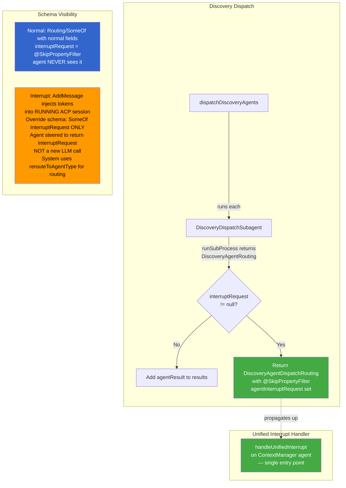

# Interrupt Simplification: Before & After

## BEFORE: Per-Subagent Interrupt Handlers

```mermaid
flowchart TD
    subgraph "Discovery Dispatch"
        DD[dispatchDiscoveryAgents] -->|runs each| DS[DiscoveryDispatchSubagent]
        DS -->|LLM returns result| DR[DiscoveryAgentResult]
        DS -->|LLM returns interrupt| DI[transitionToInterruptState<br/>DiscoveryAgentInterruptRequest]
        DI --> DH[Per-agent interrupt handler<br/>builds PromptContext<br/>calls interruptService.handleInterrupt<br/>returns DiscoveryAgentRouting]
    end

    subgraph "Planning Dispatch"
        PD[dispatchPlanningAgents] -->|runs each| PS[PlanningDispatchSubagent]
        PS -->|LLM returns result| PR[PlanningAgentResult]
        PS -->|LLM returns interrupt| PI[transitionToInterruptState<br/>PlanningAgentInterruptRequest]
        PI --> PH[Per-agent interrupt handler<br/>builds PromptContext<br/>calls interruptService.handleInterrupt<br/>returns PlanningAgentRouting]
    end

    subgraph "Ticket Dispatch"
        TD2[dispatchTicketAgents] -->|runs each| TS[TicketDispatchSubagent]
        TS -->|LLM returns result| TR[TicketAgentResult]
        TS -->|LLM returns interrupt| TI[transitionToInterruptState<br/>TicketAgentInterruptRequest]
        TI --> TH[Per-agent interrupt handler<br/>builds PromptContext<br/>calls interruptService.handleInterrupt<br/>returns TicketAgentRouting]
    end

    style DI fill:#f66,color:#fff
    style PI fill:#f66,color:#fff
    style TI fill:#f66,color:#fff
    style DH fill:#f66,color:#fff
    style PH fill:#f66,color:#fff
    style TH fill:#f66,color:#fff
```



## AFTER: Unified Interrupt + Bubble-Up



## What Was Removed

```mermaid
flowchart LR
    subgraph "Removed from Subagents (red)"
        R1[transitionToInterruptState<br/>× 3 subagent types]
        R2[ranTicketAgentResult]
        R3[ranPlanningAgent]
        R4[ranDiscoveryAgent]
    end

    subgraph "Removed from Routing"
        R5[contextManagerRequest<br/>on subagent routing types]
        R6[Subagent routing removed from<br/>Routing/SomeOf hierarchy]
    end

    subgraph "Added"
        A1[DispatchedAgentRouting<br/>sealed interface]
        A2[@SkipPropertyFilter<br/>agentInterruptRequest<br/>on dispatch routing]
        A3[handleUnifiedInterrupt<br/>on ContextManager]
    end

    style R1 fill:#f66,color:#fff
    style R2 fill:#f66,color:#fff
    style R3 fill:#f66,color:#fff
    style R4 fill:#f66,color:#fff
    style R5 fill:#f66,color:#fff
    style R6 fill:#f66,color:#fff
    style A1 fill:#4a4,color:#fff
    style A2 fill:#4a4,color:#fff
    style A3 fill:#4a4,color:#fff
```
