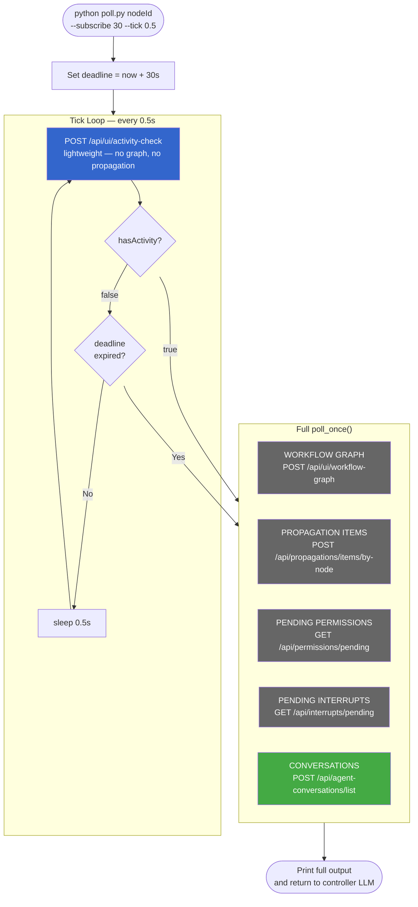
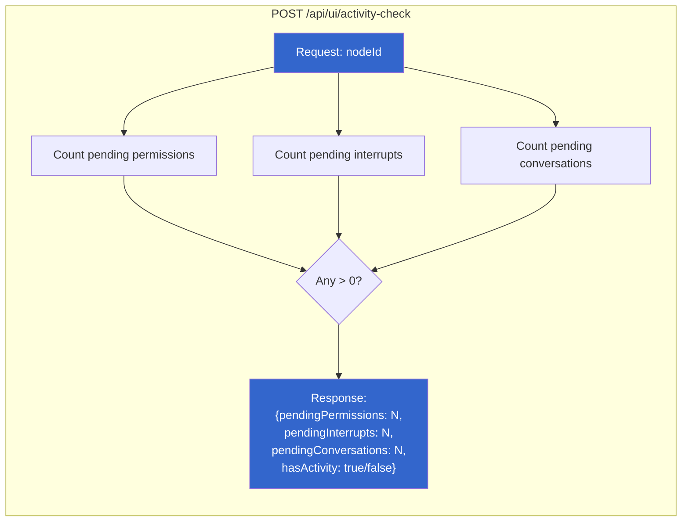

# Subscribe-Style Polling Flow

## poll.py --subscribe Mode

```mermaid
flowchart TD
    START([python poll.py nodeId<br/>--subscribe 30 --tick 0.5]) --> INIT[Set deadline = now + 30s]

    INIT --> TICK_LOOP

    subgraph TICK_LOOP [Tick Loop — every 0.5s]
        LIGHT[POST /api/ui/activity-check<br/>lightweight — no graph, no propagation]
        LIGHT --> RESPONSE{hasActivity?}
        RESPONSE -->|false| EXPIRED{deadline<br/>expired?}
        EXPIRED -->|No| SLEEP[sleep 0.5s] --> LIGHT
    end

    RESPONSE -->|true| FULL_POLL
    EXPIRED -->|Yes| FULL_POLL

    subgraph FULL_POLL [Full poll_once&lpar;&rpar;]
        G[WORKFLOW GRAPH<br/>POST /api/ui/workflow-graph]
        P[PROPAGATION ITEMS<br/>POST /api/propagations/items/by-node]
        PERM[PENDING PERMISSIONS<br/>GET /api/permissions/pending]
        INT[PENDING INTERRUPTS<br/>GET /api/interrupts/pending]
        CONV[CONVERSATIONS<br/>POST /api/agent-conversations/list]
    end

    FULL_POLL --> OUTPUT([Print full output<br/>and return to controller LLM])

    style LIGHT fill:#36c,color:#fff
    style G fill:#666,color:#fff
    style P fill:#666,color:#fff
    style PERM fill:#666,color:#fff
    style INT fill:#666,color:#fff
    style CONV fill:#4a4,color:#fff
```

## Activity Check Endpoint (Lightweight)

```mermaid
flowchart LR
    subgraph "POST /api/ui/activity-check"
        REQ[Request: nodeId] --> Q1[Count pending permissions]
        REQ --> Q2[Count pending interrupts]
        REQ --> Q3[Count pending conversations]
        Q1 --> AGG{Any > 0?}
        Q2 --> AGG
        Q3 --> AGG
        AGG --> RESP["Response:<br/>{pendingPermissions: N,<br/>pendingInterrupts: N,<br/>pendingConversations: N,<br/>hasActivity: true/false}"]
    end

    style REQ fill:#36c,color:#fff
    style RESP fill:#36c,color:#fff
```

## Comparison: Watch vs Subscribe

```mermaid
gantt
    title Controller sees agent response at t=2s
    dateFormat ss
    axisFormat %Ss

    section --watch 30
    Sleep 30s (misses response)           :crit, w1, 00, 30s
    Full poll (finally sees it)           :w2, 30, 32s

    section --subscribe 30 --tick 0.5
    activity-check (nothing)              :s1, 00, 01s
    activity-check (nothing)              :s2, 01, 02s
    activity-check (ACTIVITY!)            :done, s3, 02, 03s
    Full poll (sees it immediately)       :done, s4, 03, 05s
```
