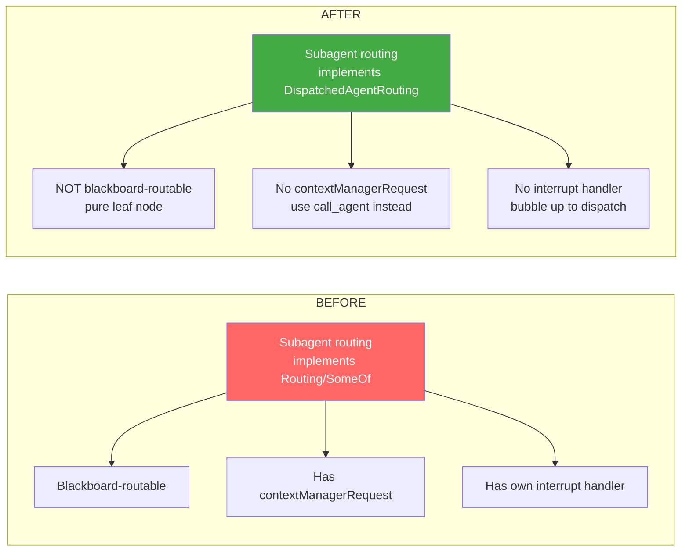

# Subagent Routing Hierarchy Change

## BEFORE: Flat Routing Hierarchy

```mermaid
classDiagram
    class SomeOf {
        <<interface>>
    }
    class Routing {
        <<sealed interface>>
    }
    SomeOf <|-- Routing

    Routing <|-- OrchestratorRouting
    Routing <|-- DiscoveryOrchestratorRouting
    Routing <|-- DiscoveryAgentRouting
    Routing <|-- DiscoveryCollectorRouting
    Routing <|-- DiscoveryAgentDispatchRouting
    Routing <|-- PlanningOrchestratorRouting
    Routing <|-- PlanningAgentRouting
    Routing <|-- PlanningCollectorRouting
    Routing <|-- PlanningAgentDispatchRouting
    Routing <|-- TicketOrchestratorRouting
    Routing <|-- TicketAgentRouting
    Routing <|-- TicketCollectorRouting
    Routing <|-- TicketAgentDispatchRouting
    Routing <|-- ReviewRouting
    Routing <|-- MergerRouting
    Routing <|-- InterruptRouting

    class DiscoveryAgentRouting {
        interruptRequest
        agentResult
        contextManagerRequest
    }
    class PlanningAgentRouting {
        interruptRequest
        agentResult
        contextManagerRequest
    }
    class TicketAgentRouting {
        interruptRequest
        agentResult
        contextManagerRequest
    }

    style DiscoveryAgentRouting fill:#f66,color:#fff
    style PlanningAgentRouting fill:#f66,color:#fff
    style TicketAgentRouting fill:#f66,color:#fff
    style ReviewRouting fill:#f66,color:#fff
    style MergerRouting fill:#f66,color:#fff
```

## AFTER: Split Hierarchy

```mermaid
classDiagram
    class AgentRouting {
        <<sealed interface>>
    }
    class SomeOf {
        <<interface>>
    }

    class Routing {
        <<sealed interface>>
    }
    class DispatchedAgentRouting {
        <<sealed interface>>
    }

    AgentRouting <|-- Routing
    AgentRouting <|-- DispatchedAgentRouting
    SomeOf <|-- Routing

    Routing <|-- OrchestratorRouting
    Routing <|-- DiscoveryOrchestratorRouting
    Routing <|-- DiscoveryCollectorRouting
    Routing <|-- DiscoveryAgentDispatchRouting
    Routing <|-- PlanningOrchestratorRouting
    Routing <|-- PlanningCollectorRouting
    Routing <|-- PlanningAgentDispatchRouting
    Routing <|-- TicketOrchestratorRouting
    Routing <|-- TicketCollectorRouting
    Routing <|-- TicketAgentDispatchRouting
    Routing <|-- InterruptRouting

    DispatchedAgentRouting <|-- DiscoveryAgentRouting
    DispatchedAgentRouting <|-- PlanningAgentRouting
    DispatchedAgentRouting <|-- TicketAgentRouting

    class DiscoveryAgentRouting {
        interruptRequest
        agentResult
    }
    class PlanningAgentRouting {
        interruptRequest
        agentResult
    }
    class TicketAgentRouting {
        interruptRequest
        agentResult
    }

    class DiscoveryAgentDispatchRouting {
        interruptRequest
        ~SkipPropertyFilter~ agentInterruptRequest
        collectorRequest
        contextManagerRequest
    }

    style DispatchedAgentRouting fill:#4a4,color:#fff
    style DiscoveryAgentRouting fill:#4a4,color:#fff
    style PlanningAgentRouting fill:#4a4,color:#fff
    style TicketAgentRouting fill:#4a4,color:#fff
    style AgentRouting fill:#36c,color:#fff
```

## Key Differences

```mermaid
flowchart LR
    subgraph "BEFORE"
        B1[Subagent routing<br/>implements Routing/SomeOf] --> B2[Blackboard-routable]
        B1 --> B3[Has contextManagerRequest]
        B1 --> B4[Has own interrupt handler]
    end

    subgraph "AFTER"
        A1[Subagent routing<br/>implements DispatchedAgentRouting] --> A2[NOT blackboard-routable<br/>pure leaf node]
        A1 --> A3[No contextManagerRequest<br/>use call_agent instead]
        A1 --> A4[No interrupt handler<br/>bubble up to dispatch]
    end

    style B1 fill:#f66,color:#fff
    style A1 fill:#4a4,color:#fff
```
