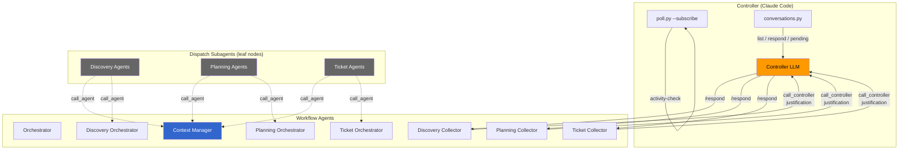
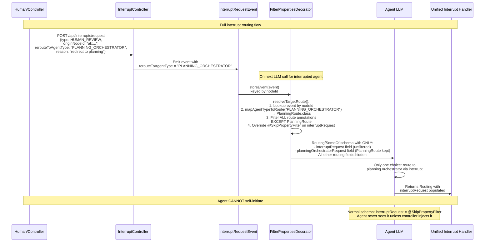
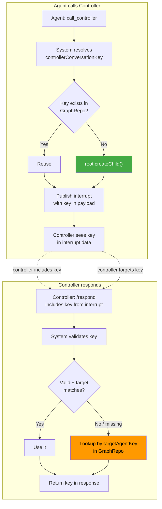

# Agent Communication Topology

## Communication Flows

```mermaid
flowchart TD
    subgraph "Controller (Claude Code)"
        CTRL[Controller LLM]
        POLL[poll.py --subscribe]
        CONVPY[conversations.py]
    end

    subgraph "Workflow Agents"
        ORCH[Orchestrator]
        D_ORCH[Discovery Orchestrator]
        P_ORCH[Planning Orchestrator]
        T_ORCH[Ticket Orchestrator]
        D_COLL[Discovery Collector]
        P_COLL[Planning Collector]
        T_COLL[Ticket Collector]
        CM[Context Manager]
    end

    subgraph "Dispatch Subagents (leaf nodes)"
        D_AGT[Discovery Agents]
        P_AGT[Planning Agents]
        T_AGT[Ticket Agents]
    end

    %% Agent → Controller (call_controller tool)
    D_COLL -->|call_controller<br/>justification| CTRL
    P_COLL -->|call_controller<br/>justification| CTRL
    T_COLL -->|call_controller<br/>justification| CTRL

    %% Controller → Agent (/api/agent-conversations/respond)
    CTRL -->|/respond| D_COLL
    CTRL -->|/respond| P_COLL
    CTRL -->|/respond| T_COLL

    %% Agent → Agent (call_agent tool)
    D_AGT -.->|call_agent| CM
    P_AGT -.->|call_agent| CM
    T_AGT -.->|call_agent| CM
    D_AGT -.->|call_agent| D_ORCH
    P_AGT -.->|call_agent| P_ORCH
    T_AGT -.->|call_agent| T_ORCH

    %% Controller polling
    POLL -->|activity-check| POLL
    CONVPY -->|list / respond / pending| CTRL

    style CTRL fill:#f90,color:#000
    style CM fill:#36c,color:#fff
    style D_AGT fill:#666,color:#fff
    style P_AGT fill:#666,color:#fff
    style T_AGT fill:#666,color:#fff
```

## Interrupt Flow (Controller-Initiated Only)

```mermaid
sequenceDiagram
    participant Human/Controller
    participant InterruptController
    participant InterruptRequestEvent
    participant FilterPropertiesDecorator
    participant Agent LLM
    participant Unified Interrupt Handler

    Note over Human/Controller,Unified Interrupt Handler: Full interrupt routing flow

    Human/Controller->>InterruptController: POST /api/interrupts/request<br/>{type: HUMAN_REVIEW,<br/>originNodeId: "ak:...",<br/>rerouteToAgentType: "PLANNING_ORCHESTRATOR",<br/>reason: "redirect to planning"}

    InterruptController->>InterruptRequestEvent: Emit event with<br/>rerouteToAgentType = "PLANNING_ORCHESTRATOR"

    Note over FilterPropertiesDecorator: On next LLM call for interrupted agent

    InterruptRequestEvent->>FilterPropertiesDecorator: storeEvent(event)<br/>keyed by nodeId
    FilterPropertiesDecorator->>FilterPropertiesDecorator: resolveTargetRoute():<br/>1. Lookup event by nodeId<br/>2. mapAgentTypeToRoute("PLANNING_ORCHESTRATOR")<br/>   → PlanningRoute.class<br/>3. Filter ALL route annotations<br/>   EXCEPT PlanningRoute<br/>4. Override @SkipPropertyFilter on interruptRequest

    FilterPropertiesDecorator->>Agent LLM: Routing/SomeOf schema with ONLY:<br/>- interruptRequest field (unfiltered)<br/>- planningOrchestratorRequest field (PlanningRoute kept)<br/>All other routing fields hidden

    Agent LLM->>Agent LLM: Only one choice: route to<br/>planning orchestrator via interrupt

    Agent LLM->>Unified Interrupt Handler: Returns Routing with<br/>interruptRequest populated

    Note over Human/Controller,Unified Interrupt Handler: Agent CANNOT self-initiate
    Note over Agent LLM: Normal schema: interruptRequest = @SkipPropertyFilter<br/>Agent never sees it unless controller injects it
```

## Conversation Key in Communication

```mermaid
flowchart TD
    subgraph "Agent calls Controller"
        A1[Agent: call_controller] --> A2[System resolves<br/>controllerConversationKey]
        A2 --> A3{Key exists in<br/>GraphRepo?}
        A3 -->|Yes| A4[Reuse]
        A3 -->|No| A5[root.createChild&lpar;&rpar;]
        A4 --> A6[Publish interrupt<br/>with key in payload]
        A5 --> A6
        A6 --> A7[Controller sees key<br/>in interrupt data]
    end

    subgraph "Controller responds"
        B1[Controller: /respond<br/>includes key from interrupt] --> B2[System validates key]
        B2 --> B3{Valid + target<br/>matches?}
        B3 -->|Yes| B4[Use it]
        B3 -->|No / missing| B5[Lookup by targetAgentKey<br/>in GraphRepo]
        B4 --> B6[Return key in response]
        B5 --> B6
    end

    A7 -.->|controller includes key| B1
    A7 -.->|controller forgets key| B1

    style A5 fill:#4a4,color:#fff
    style B5 fill:#f90,color:#000
```
