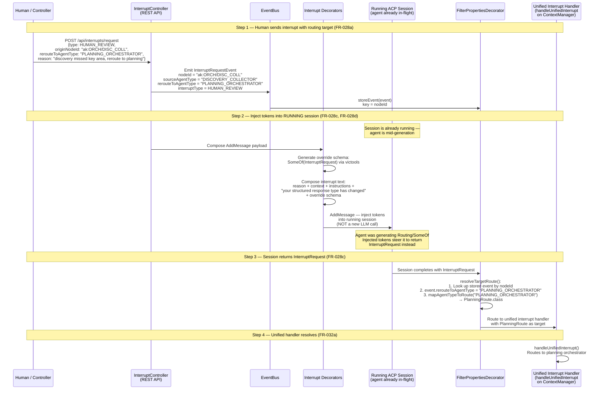
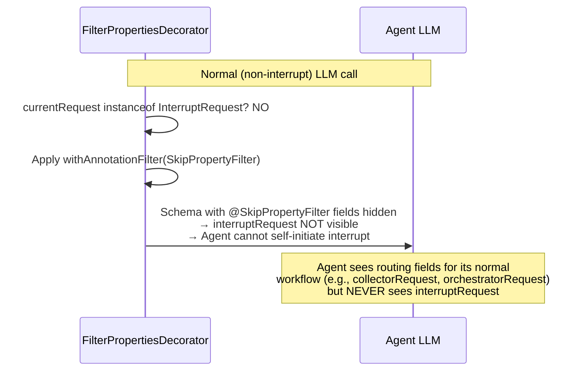
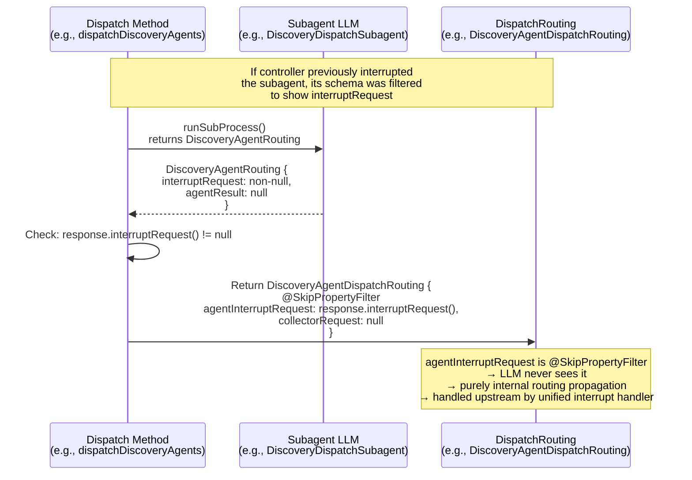
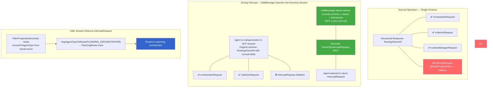

# Interrupt Routing Flow (Story 9)

## End-to-End: Human/Controller Interrupts an Agent

This chart covers the complete interrupt lifecycle per FR-022 through FR-032e.



## Normal Operation: Agent Never Sees Interrupt (FR-028, FR-032)



## Subagent Interrupt Bubble-Up (FR-032e)



## What Agents See: Schema Comparison



## Validation Edge Cases

```mermaid
flowchart TD
    REQ[POST /api/interrupts/request] --> CHECK_TYPE{type =<br/>HUMAN_REVIEW?}

    CHECK_TYPE -->|No| OTHER[PAUSE/STOP/PRUNE:<br/>rerouteToAgentType optional]
    CHECK_TYPE -->|Yes| CHECK_REROUTE{rerouteToAgentType<br/>provided?}

    CHECK_REROUTE -->|No / null| REJECT_400["400 Bad Request:<br/>HUMAN_REVIEW requires<br/>rerouteToAgentType"]

    CHECK_REROUTE -->|Yes| MAP[mapAgentTypeToRoute<br/>(rerouteToAgentType)]
    MAP --> CHECK_MAP{Returns<br/>route annotation?}

    CHECK_MAP -->|null| REJECT_INVALID["400 Bad Request:<br/>Agent type has no route<br/>(e.g., DISCOVERY_AGENT,<br/>TICKET_AGENT are leaf types<br/>— not routing targets)"]

    CHECK_MAP -->|Valid| EMIT[Emit InterruptRequestEvent<br/>with rerouteToAgentType]

    style REJECT_400 fill:#f66,color:#fff
    style REJECT_INVALID fill:#f66,color:#fff
    style EMIT fill:#4a4,color:#fff
```
