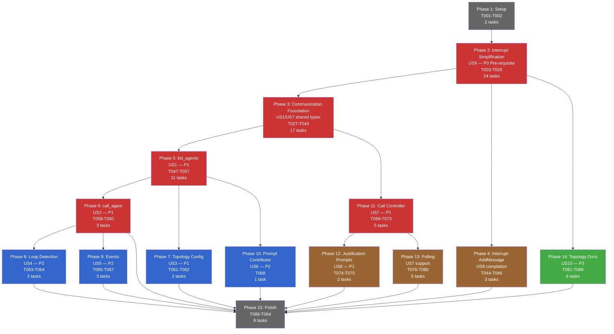
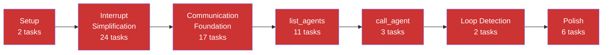

# Task Dependency Graph

## Phase Dependencies & Critical Path



Legend: Red = critical path, Blue = secondary path, Orange = support work, Green = independent, Gray = bookends.

## Critical Path (longest dependency chain)



**Critical path length**: 65 tasks (sequential minimum)

## Parallel Execution Lanes

```mermaid
gantt
    title Parallel Execution Lanes
    dateFormat X
    axisFormat %s

    section Lane A (Critical)
    Setup (T001-T002)              :a1, 0, 2
    Interrupt Simplification (T003-T026) :a2, after a1, 24
    Communication Foundation (T027-T043) :a3, after a2, 17
    list_agents (T047-T057)        :a5, after a3, 11
    call_agent (T058-T060)         :a6, after a5, 3
    Loop Detection (T063-T064)     :a8, after a6, 2
    Events (T065-T067)             :a9, after a6, 3
    Polish (T089-T094)             :a15, after a8, 6

    section Lane B (Controller)
    Call Controller (T069-T073)    :b11, after a3, 5
    Justification Prompts (T074-T075) :b12, after b11, 2
    Polling (T076-T080)            :b13, after b11, 5

    section Lane C (Independent)
    Interrupt AddMessage (T044-T046) :c4, after a2, 3
    Topology Config (T061-T062)    :c7, after a5, 2
    Prompt Contributor (T068)      :c10, after a5, 1
    Topology Docs (T081-T088)      :c14, after a2, 8
```
