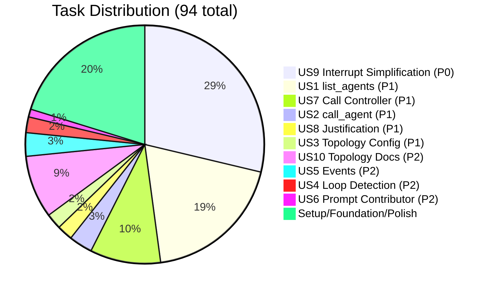
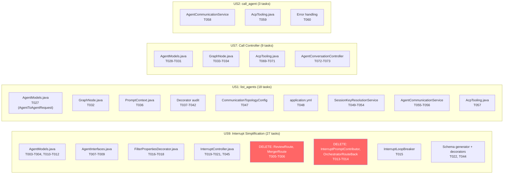
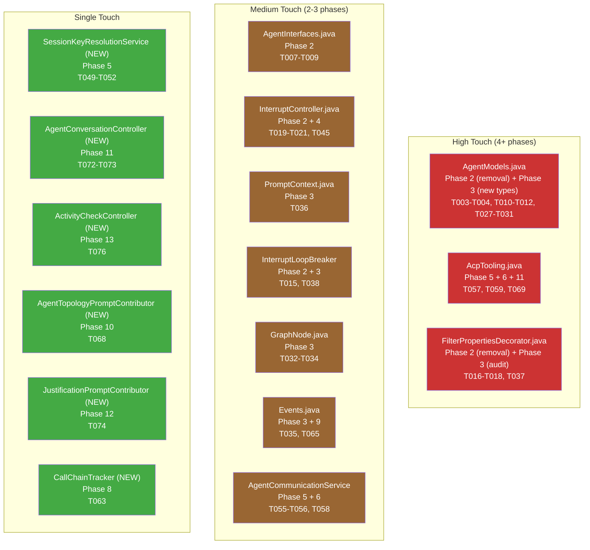

# Task Distribution by User Story

## Tasks per Story

## Story-to-File Mapping

## File Touch Frequency

Shows which files are modified across multiple phases — high-touch files need careful sequencing.

