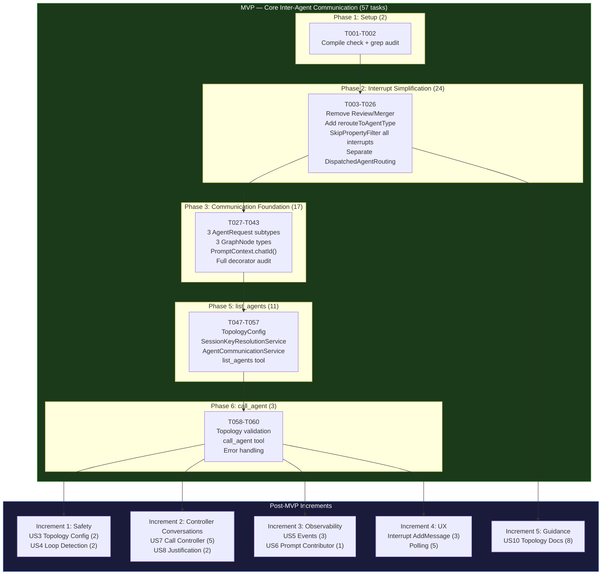
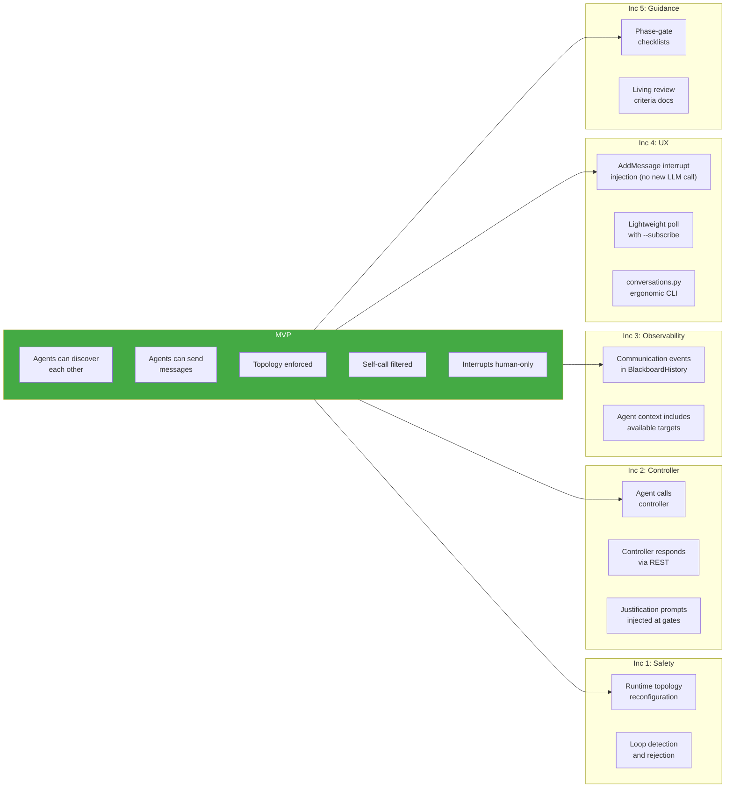
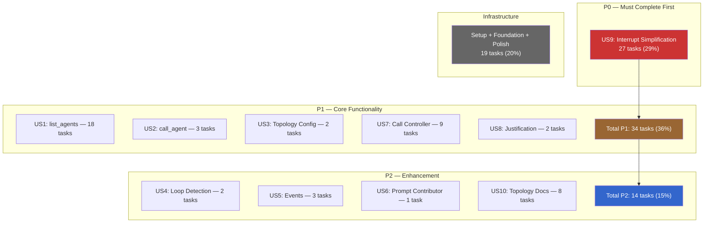

# MVP Scope & Incremental Delivery

## MVP Boundary (Phases 1-6)

```mermaid
flowchart TD
    subgraph MVP ["MVP — Core Inter-Agent Communication (57 tasks)"]
        direction TB
        subgraph "Phase 1: Setup (2)"
            S1["T001-T002<br/>Compile check + grep audit"]
        end
        subgraph "Phase 2: Interrupt Simplification (24)"
            S2["T003-T026<br/>Remove Review/Merger<br/>Add rerouteToAgentType<br/>SkipPropertyFilter all interrupts<br/>Separate DispatchedAgentRouting"]
        end
        subgraph "Phase 3: Communication Foundation (17)"
            S3["T027-T043<br/>3 AgentRequest subtypes<br/>3 GraphNode types<br/>PromptContext.chatId()<br/>Full decorator audit"]
        end
        subgraph "Phase 5: list_agents (11)"
            S5["T047-T057<br/>TopologyConfig<br/>SessionKeyResolutionService<br/>AgentCommunicationService<br/>list_agents tool"]
        end
        subgraph "Phase 6: call_agent (3)"
            S6["T058-T060<br/>Topology validation<br/>call_agent tool<br/>Error handling"]
        end

        S1 --> S2 --> S3 --> S5 --> S6
    end

    subgraph POST_MVP ["Post-MVP Increments"]
        direction TB
        I1["Increment 1: Safety<br/>US3 Topology Config (2)<br/>US4 Loop Detection (2)"]
        I2["Increment 2: Controller Conversations<br/>US7 Call Controller (5)<br/>US8 Justification (2)"]
        I3["Increment 3: Observability<br/>US5 Events (3)<br/>US6 Prompt Contributor (1)"]
        I4["Increment 4: UX<br/>Interrupt AddMessage (3)<br/>Polling (5)"]
        I5["Increment 5: Guidance<br/>US10 Topology Docs (8)"]
    end

    S6 --> I1
    S6 --> I2
    S6 --> I3
    S6 --> I4
    S2 --> I5

    style MVP fill:#1a3a1a,color:#fff,stroke:#4a4
    style POST_MVP fill:#1a1a3a,color:#fff,stroke:#36c
```

## What Each Increment Delivers

```mermaid
flowchart LR
    subgraph "MVP"
        MVP1["Agents can discover<br/>each other"]
        MVP2["Agents can send<br/>messages"]
        MVP3["Topology enforced"]
        MVP4["Self-call filtered"]
        MVP5["Interrupts human-only"]
    end

    subgraph "Inc 1: Safety"
        INC1_1["Runtime topology<br/>reconfiguration"]
        INC1_2["Loop detection<br/>and rejection"]
    end

    subgraph "Inc 2: Controller"
        INC2_1["Agent calls<br/>controller"]
        INC2_2["Controller responds<br/>via REST"]
        INC2_3["Justification prompts<br/>injected at gates"]
    end

    subgraph "Inc 3: Observability"
        INC3_1["Communication events<br/>in BlackboardHistory"]
        INC3_2["Agent context includes<br/>available targets"]
    end

    subgraph "Inc 4: UX"
        INC4_1["AddMessage interrupt<br/>injection (no new LLM call)"]
        INC4_2["Lightweight poll<br/>with --subscribe"]
        INC4_3["conversations.py<br/>ergonomic CLI"]
    end

    subgraph "Inc 5: Guidance"
        INC5_1["Phase-gate<br/>checklists"]
        INC5_2["Living review<br/>criteria docs"]
    end

    MVP --> INC1_1
    MVP --> INC2_1
    MVP --> INC3_1
    MVP --> INC4_1
    MVP --> INC5_1

    style MVP fill:#4a4,color:#fff
```

## Task Counts by Priority

```mermaid
flowchart TD
    subgraph "P0 — Must Complete First"
        P0["US9: Interrupt Simplification<br/>27 tasks (29%)"]
    end

    subgraph "P1 — Core Functionality"
        P1_1["US1: list_agents — 18 tasks"]
        P1_2["US2: call_agent — 3 tasks"]
        P1_3["US3: Topology Config — 2 tasks"]
        P1_4["US7: Call Controller — 9 tasks"]
        P1_5["US8: Justification — 2 tasks"]
        P1_T["Total P1: 34 tasks (36%)"]
    end

    subgraph "P2 — Enhancement"
        P2_1["US4: Loop Detection — 2 tasks"]
        P2_2["US5: Events — 3 tasks"]
        P2_3["US6: Prompt Contributor — 1 task"]
        P2_4["US10: Topology Docs — 8 tasks"]
        P2_T["Total P2: 14 tasks (15%)"]
    end

    subgraph "Infrastructure"
        INF["Setup + Foundation + Polish<br/>19 tasks (20%)"]
    end

    P0 --> P1_T
    P1_T --> P2_T

    style P0 fill:#c33,color:#fff
    style P1_T fill:#963,color:#fff
    style P2_T fill:#36c,color:#fff
    style INF fill:#666,color:#fff
```
